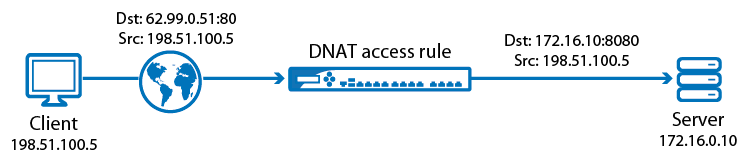
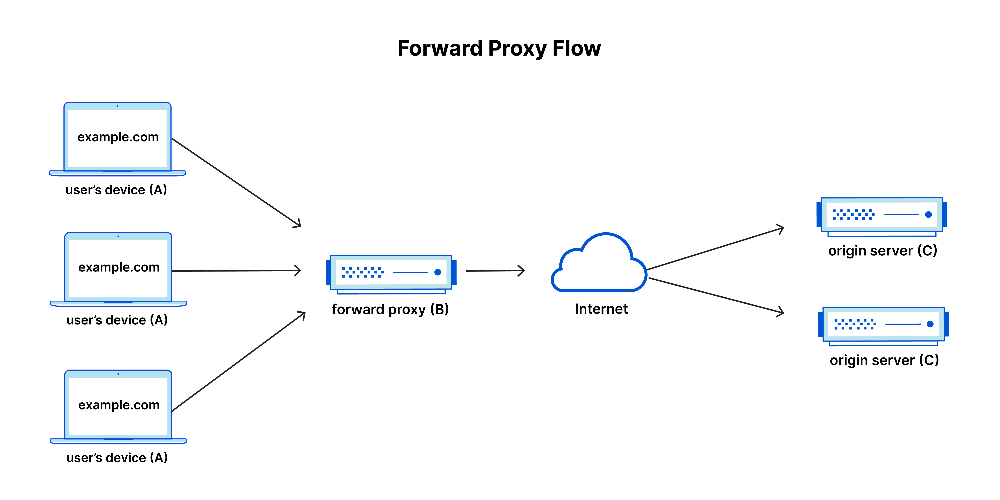
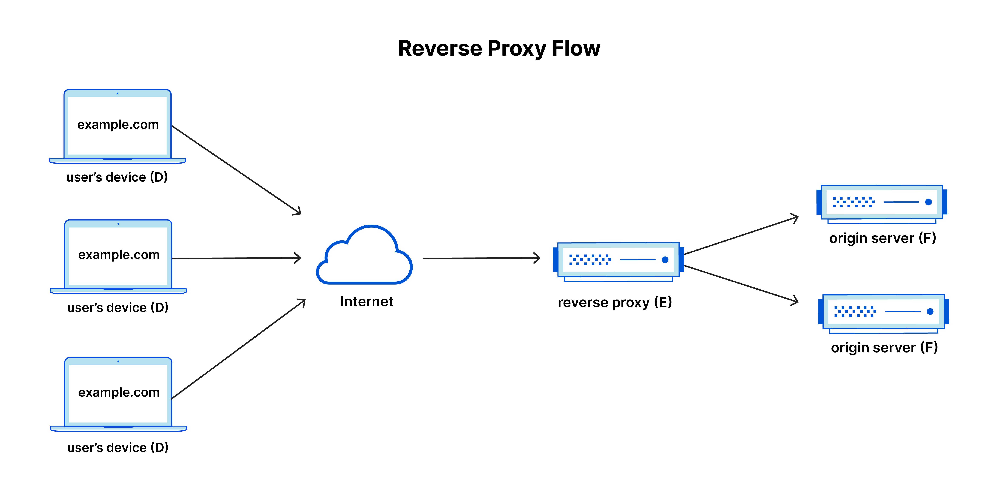

# Nginx Presentation

## Problems:
1. Accessing private network from public network
2. Multiple web servers in one machine or behind single IP
3. load balancing and fault tolerance

## Solutions:
#### Accessing private network from public network
1. DNAT

2. Layer 4 load balancer  
like haproxy and nginx

#### Multiple web servers in one machine or behind single IP
What is reverse proxy server?



Popular Reverse Proxy servers:
- Nginx
- Envoy
- Haproxy
- Caddy
- Traefik

#### load balancing and fault tolerance
1. load balancing based on hostname and request uri
2. auto scaling

## Nginx Main Features:
- Serving static and index files
- Accelerated reverse proxying with caching
- load balancing and fault tolerance
- TLS and SSL termination

### Other Features:
- URI changing using regular expressions
- Rate limit
- Authentication using external service
- Canary
- SSL passthrough
- Consistent hashing

## What is Ingress Controller (Reverse Proxies in K8s)

Kubernetes Controller for `Ingress` resources!

- Integrated Monitoring
- Cloud Native
- Dynamic endpoint detect
- Easy configuration by annotations

## Examples

### 1. Serve static files

```bash
docker run --name nginx --rm -v ${PWD}:/usr/share/nginx/html -p 8000:80 nginx:1.24.0
```
```docker-compose
services:
  nginx:
    image: nginx:1.24.0
    container_name: nginx
    ports:
        - 8000:80
    volumes:
      - ./:/usr/share/nginx/html
```

### 2. Caching in Ingress
```yaml
apiVersion: networking.k8s.io/v1
kind: Ingress
metadata:
  annotations:
    nginx.ingress.kubernetes.io/enable-cors: "true"
    nginx.ingress.kubernetes.io/cors-allow-methods: GET, OPTIONS
    # when rgw is down, proxy_cache_use_stale doesn't work because there is no upstream at all.
    nginx.ingress.kubernetes.io/service-upstream: "true"
    nginx.ingress.kubernetes.io/proxy-buffering: "on"
    nginx.ingress.kubernetes.io/configuration-snippet: |
      proxy_cache                   main-cache;
      proxy_cache_key               $host$uri$is_args$args;
      proxy_cache_revalidate        on;
      proxy_cache_background_update on;
      proxy_cache_use_stale         error timeout invalid_header updating http_500 http_502 http_503 http_504 http_403 http_404 http_429;
      proxy_cache_lock              on;
      proxy_cache_lock_age          1s;
      proxy_ignore_headers          Expires Cache-Control Set-Cookie Vary;
      proxy_cache_valid             200 206 302 304 6h;
      proxy_hide_header             Cache-Control;
      proxy_hide_header             Expires;
      add_header                    X-cache-Status-Avb $upstream_cache_status;
    nginx.ingress.kubernetes.io/ssl-redirect: "false"
    nginx.ingress.kubernetes.io/use-regex: "true"
  name: echo.tapsell.ir
  namespace: rook-ceph
spec:
  ingressClassName: nginx
  tls:
  - secretName: tapture-ir
  rules:
  - host: cdn.tapture.ir
    http:
      paths:
      - path: /
        backend:
          service:
            name: echo
            port:
              number: 80
        pathType: Prefix
```

### 3. Consistent hashing

```bash
for j in {1..10};
do 
    for i in {1..10};
    do 
        curl https://echo.tapsell.ir/sina --resolve echo.tapsell.ir:443:46.245.80.243 -H 'Mosi: amin' -k -s | grep "pod name:";
    done;
    sleep 1;
    echo;
    echo;
done
```